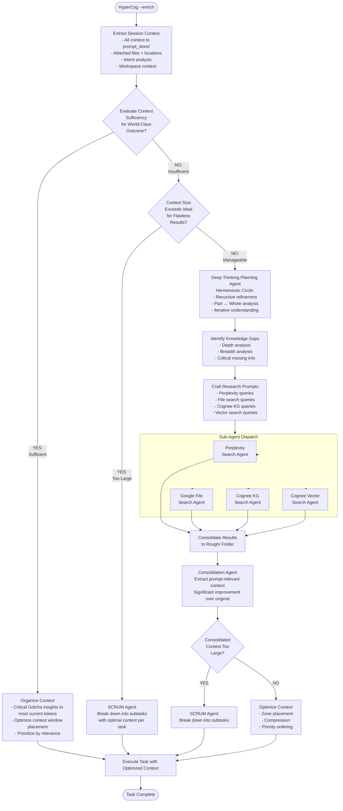

## HyperCog MCP Orchestration Flowchart




## Implementation Roadmap: Day 1 Vibe Coding Setup

### Phase 1: Local Infrastructure Setup (2 hours)

#### Step 1: FalkorDB Local Setup

```bash
# Launch FalkorDB with Docker
docker run -d \
  --name falkordb \
  -p 6379:6379 \
  -p 3000:3000 \
  -v falkordb_data:/data \
  falkordb/falkordb:latest

# Verify it's running
curl http://localhost:3000
```


#### Step 2: Cognee + FalkorDB Integration

```bash
# Create project directory
mkdir hypercog-mcp && cd hypercog-mcp

# Create virtual environment
python3.11 -m venv venv
source venv/bin/activate  # On Windows: venv\Scripts\activate

# Install Cognee with FalkorDB adapter
pip install cognee
pip install "cognee[falkordb]"
pip install cognee-community-hybrid-adapter-falkor

# Install additional dependencies
pip install google-generativeai  # For Gemini File Search
pip install mcp  # MCP SDK
pip install asyncio aiofiles
```


#### Step 3: Project Structure Setup

```bash
# Create directory structure
mkdir -p hypercog_mcp/{
  agents/{prompts,state},
  sub_agents/{perplexity,file_search,cognee_kg,cognee_vector},
  storage/{prompt_store,rough,optimized},
  config,
  tools,
  cli
}

# Create agent prompt files (editable by user)
touch hypercog_mcp/agents/prompts/evaluator_agent.md
touch hypercog_mcp/agents/prompts/organizer_agent.md
touch hypercog_mcp/agents/prompts/deep_thinking_agent.md
touch hypercog_mcp/agents/prompts/consolidator_agent.md
touch hypercog_mcp/agents/prompts/scrum_agent.md

# Create sub-agent prompt files
touch hypercog_mcp/sub_agents/perplexity/system_prompt.md
touch hypercog_mcp/sub_agents/file_search/system_prompt.md
touch hypercog_mcp/sub_agents/cognee_kg/system_prompt.md
touch hypercog_mcp/sub_agents/cognee_vector/system_prompt.md
```


### Phase 2: Core Configuration (1 hour)

#### Step 4: Cognee Configuration File

```python
# hypercog_mcp/config/cognee_config.py
import os
from pathlib import Path
from cognee import config
import cognee_community_hybrid_adapter_falkor.register

def setup_cognee():
    """Configure Cognee with FalkorDB"""
    
    # Set directories
    system_root = Path(__file__).parent.parent / ".cognee_system"
    data_root = Path(__file__).parent.parent / ".cognee_data"
    
    config.system_root_directory(str(system_root))
    config.data_root_directory(str(data_root))
    
    # Configure FalkorDB as graph database
    config.set_graph_db_config({
        "graph_database_provider": "falkordb",
        "graph_database_url": os.getenv("GRAPH_DB_URL", "localhost"),
        "graph_database_port": int(os.getenv("GRAPH_DB_PORT", "6379")),
    })
    
    # Configure FalkorDB as vector database (hybrid mode)
    config.set_vector_db_config({
        "vector_db_provider": "falkordb",
        "vector_db_url": os.getenv("VECTOR_DB_URL", "localhost"),
        "vector_db_port": int(os.getenv("VECTOR_DB_PORT", "6379")),
    })
    
    # Configure LLM
    config.set_llm_config({
        "llm_provider": "openai",
        "llm_model": os.getenv("LLM_MODEL", "gpt-4"),
        "llm_api_key": os.getenv("OPENAI_API_KEY"),
    })
    
    print("✓ Cognee configured with FalkorDB")
```


#### Step 5: Google File Search Configuration

```python
# hypercog_mcp/config/gemini_config.py
import os
import google.generativeai as genai

def setup_gemini_file_search():
    """Configure Google Gemini File Search"""
    
    api_key = os.getenv("GOOGLE_API_KEY")
    if not api_key:
        raise ValueError("GOOGLE_API_KEY environment variable required")
    
    genai.configure(api_key=api_key)
    
    # Create or get file search store
    store_name = "hypercog-context-store"
    
    print(f"✓ Gemini File Search configured: {store_name}")
    return store_name
```


#### Step 6: Environment Variables

```bash
# Create .env file
cat > .env << 'EOF'
# LLM Configuration
OPENAI_API_KEY=your_openai_api_key
GOOGLE_API_KEY=your_google_api_key

# FalkorDB Configuration
GRAPH_DB_URL=localhost
GRAPH_DB_PORT=6379
VECTOR_DB_URL=localhost
VECTOR_DB_PORT=6379

# LLM Models
LLM_MODEL=gpt-4
EMBEDDING_MODEL=text-embedding-3-small

# HyperCog Configuration
MAX_CONTEXT_TOKENS=128000
CRITICAL_ZONE_RATIO=0.3
IMPORTANT_ZONE_RATIO=0.4
BACKGROUND_ZONE_RATIO=0.3
EOF
```


### Phase 3: Agent System Architecture (3 hours)

#### Step 7: Base Agent Class

```python
# hypercog_mcp/agents/base_agent.py
from abc import ABC, abstractmethod
from pathlib import Path
from typing import Dict, Any, Optional
import json

class BaseAgent(ABC):
    """Base class for all HyperCog agents"""
    
    def __init__(self, name: str, prompt_file: str):
        self.name = name
        self.prompt_file = Path(prompt_file)
        self.system_prompt = self._load_prompt()
        self.state = {}
    
    def _load_prompt(self) -> str:
        """Load system prompt from markdown file"""
        if not self.prompt_file.exists():
            raise FileNotFoundError(f"Prompt file not found: {self.prompt_file}")
        return self.prompt_file.read_text()
    
    def reload_prompt(self):
        """Reload prompt from file (for live editing)"""
        self.system_prompt = self._load_prompt()
        print(f"✓ Reloaded prompt for {self.name}")
    
    @abstractmethod
    async def execute(self, context: Dict[str, Any]) -> Dict[str, Any]:
        """Execute agent logic"""
        pass
    
    def save_state(self, state_dir: Path):
        """Save agent state to disk"""
        state_file = state_dir / f"{self.name}_state.json"
        state_file.write_text(json.dumps(self.state, indent=2))
    
    def load_state(self, state_dir: Path):
        """Load agent state from disk"""
        state_file = state_dir / f"{self.name}_state.json"
        if state_file.exists():
            self.state = json.loads(state_file.read_text())
```


#### Step 8: Context Extractor

```python
# hypercog_mcp/agents/context_extractor.py
from pathlib import Path
from typing import Dict, Any, List
import json
import shutil

class ContextExtractor:
    """Extracts all session context to prompt_store/"""
    
    def __init__(self, storage_root: Path):
        self.storage_root = storage_root
        self.prompt_store = storage_root / "prompt_store"
        self.prompt_store.mkdir(exist_ok=True)
    
    async def extract_context(
        self, 
        session_context: str,
        attached_files: List[Path],
        workspace_path: Optional[Path] = None
    ) -> Dict[str, Any]:
        """Extract all context to prompt_store/"""
        
        # Create timestamped extraction directory
        from datetime import datetime
        timestamp = datetime.now().strftime("%Y%m%d_%H%M%S")
        extract_dir = self.prompt_store / timestamp
        extract_dir.mkdir(exist_ok=True)
        
        # Save session context
        context_file = extract_dir / "session_context.txt"
        context_file.write_text(session_context)
        
        # Copy attached files
        files_dir = extract_dir / "attached_files"
        files_dir.mkdir(exist_ok=True)
        
        file_manifest = []
        for file_path in attached_files:
            if file_path.exists():
                dest = files_dir / file_path.name
                shutil.copy2(file_path, dest)
                file_manifest.append({
                    "original": str(file_path),
                    "stored": str(dest),
                    "size": file_path.stat().st_size
                })
        
        # Save file manifest
        manifest_file = extract_dir / "file_manifest.json"
        manifest_file.write_text(json.dumps(file_manifest, indent=2))
        
        # Extract workspace info
        workspace_info = {}
        if workspace_path and workspace_path.exists():
            workspace_info = {
                "path": str(workspace_path),
                "files": [str(f) for f in workspace_path.rglob("*") if f.is_file()]
            }
        
        # Save metadata
        metadata = {
            "timestamp": timestamp,
            "context_file": str(context_file),
            "file_count": len(file_manifest),
            "workspace": workspace_info,
            "extraction_dir": str(extract_dir)
        }
        
        metadata_file = extract_dir / "metadata.json"
        metadata_file.write_text(json.dumps(metadata, indent=2))
        
        print(f"✓ Context extracted to {extract_dir}")
        return metadata
```


#### Step 9: Evaluator Agent

```python
# hypercog_mcp/agents/evaluator_agent.py
from .base_agent import BaseAgent
from typing import Dict, Any
import json

class EvaluatorAgent(BaseAgent):
    """Evaluates if context is sufficient for world-class outcomes"""
    
    def __init__(self, prompt_file: str, llm_client):
        super().__init__("evaluator", prompt_file)
        self.llm = llm_client
    
    async def execute(self, context: Dict[str, Any]) -> Dict[str, Any]:
        """Evaluate context sufficiency"""
        
        # Load extracted context
        session_context = context.get("session_context", "")
        files = context.get("files", [])
        workspace = context.get("workspace", {})
        current_prompt = context.get("current_prompt", "")
        
        # Build evaluation prompt
        eval_prompt = f"""
{self.system_prompt}

## Context to Evaluate:

### Current Prompt:
{current_prompt}

### Session Context:
{session_context}

### Available Files:
{json.dumps(files, indent=2)}

### Workspace:
{json.dumps(workspace, indent=2)}

## Evaluation Task:
Determine if the provided context is sufficient to produce a world-class outcome for the current prompt.

Respond in JSON format:
{{
    "sufficient": true/false,
    "confidence": 0.0-1.0,
    "reasoning": "detailed explanation",
    "missing_elements": ["list", "of", "gaps"],
    "context_size_assessment": "manageable/too_large",
    "critical_insights": ["key", "gotcha", "insights"]
}}
"""
        
        # Call LLM
        response = await self.llm.generate(eval_prompt)
        evaluation = json.loads(response)
        
        self.state = evaluation
        return evaluation
```


#### Step 10: Deep Thinking Agent with Hermeneutic Circle

```python
# hypercog_mcp/agents/deep_thinking_agent.py
from .base_agent import BaseAgent
from typing import Dict, Any, List

class DeepThinkingAgent(BaseAgent):
    """Planning agent using hermeneutic circle for recursive refinement"""
    
    def __init__(self, prompt_file: str, llm_client):
        super().__init__("deep_thinking", prompt_file)
        self.llm = llm_client
        self.max_iterations = 3
    
    async def execute(self, context: Dict[str, Any]) -> Dict[str, Any]:
        """Apply hermeneutic circle to identify knowledge gaps"""
        
        current_understanding = context.get("evaluation", {})
        missing_elements = current_understanding.get("missing_elements", [])
        
        # Hermeneutic circle: iterative refinement
        for iteration in range(self.max_iterations):
            print(f"  → Hermeneutic iteration {iteration + 1}/{self.max_iterations}")
            
            hermeneutic_prompt = f"""
{self.system_prompt}

## Hermeneutic Circle Iteration {iteration + 1}

### Current Understanding:
{json.dumps(current_understanding, indent=2)}

### Task:
Use the hermeneutic circle to analyze this question thoroughly:
1. Examine the PARTS (individual missing elements)
2. Consider the WHOLE (overall context gap)
3. Refine understanding by going back and forth
4. Identify deeper, hidden gaps

Current missing elements: {missing_elements}

Respond with refined analysis in JSON:
{{
    "refined_gaps": [
        {{
            "gap": "specific gap",
            "depth": "surface/medium/deep",
            "breadth": "narrow/medium/broad",
            "priority": 1-10,
            "search_strategy": "perplexity/file_search/cognee_kg/cognee_vector"
        }}
    ],
    "understanding_improved": true/false,
    "continue_iteration": true/false
}}
"""
            
            response = await self.llm.generate(hermeneutic_prompt)
            analysis = json.loads(response)
            
            # Update understanding
            current_understanding = analysis
            
            if not analysis.get("continue_iteration", False):
                break
        
        self.state = current_understanding
        return current_understanding
```


#### Step 11: Sub-Agent Base Class

```python
# hypercog_mcp/sub_agents/base_sub_agent.py
from abc import ABC, abstractmethod
from pathlib import Path
from typing import Dict, Any, List

class BaseSubAgent(ABC):
    """Base class for research sub-agents"""
    
    def __init__(self, name: str, prompt_file: Path):
        self.name = name
        self.prompt_file = prompt_file
        self.system_prompt = prompt_file.read_text() if prompt_file.exists() else ""
    
    @abstractmethod
    async def search(self, query: str, context: Dict[str, Any]) -> List[Dict[str, Any]]:
        """Execute search and return results"""
        pass
    
    def format_results(self, results: List[Dict[str, Any]]) -> str:
        """Format results for consolidation"""
        formatted = f"\n## {self.name} Results\n\n"
        for i, result in enumerate(results, 1):
            formatted += f"### Result {i}\n"
            formatted += f"**Source:** {result.get('source', 'Unknown')}\n"
            formatted += f"**Content:** {result.get('content', '')}\n\n"
        return formatted
```


#### Step 12: Cognee KG Sub-Agent

```python
# hypercog_mcp/sub_agents/cognee_kg_sub_agent.py
from .base_sub_agent import BaseSubAgent
from cognee import search, SearchType
from typing import Dict, Any, List

class CogneeKGSubAgent(BaseSubAgent):
    """Cognee Knowledge Graph search sub-agent"""
    
    async def search(self, query: str, context: Dict[str, Any]) -> List[Dict[str, Any]]:
        """Search Cognee knowledge graph"""
        
        print(f"  🔍 Cognee KG searching: {query}")
        
        # Use graph completion for multi-hop reasoning
        results = await search(
            query,
            search_type=SearchType.GRAPH_COMPLETION
        )
        
        formatted_results = []
        for result in results:
            formatted_results.append({
                "source": "cognee_kg",
                "query": query,
                "content": result.get("text", ""),
                "metadata": result.get("metadata", {})
            })
        
        return formatted_results
```


#### Step 13: Gemini File Search Sub-Agent

```python
# hypercog_mcp/sub_agents/file_search_sub_agent.py
from .base_sub_agent import BaseSubAgent
import google.generativeai as genai
from typing import Dict, Any, List

class FileSearchSubAgent(BaseSubAgent):
    """Google Gemini File Search sub-agent"""
    
    def __init__(self, prompt_file, store_name: str):
        super().__init__("file_search", prompt_file)
        self.store_name = store_name
        self.model = genai.GenerativeModel('gemini-1.5-flash')
    
    async def upload_files(self, files: List[str]):
        """Upload files to Gemini File Search store"""
        for file_path in files:
            print(f"  📤 Uploading {file_path} to Gemini File Search")
            # Upload to file search store
            # genai.upload_to_file_search_store(file_path, store=self.store_name)
    
    async def search(self, query: str, context: Dict[str, Any]) -> List[Dict[str, Any]]:
        """Search using Gemini File Search RAG"""
        
        print(f"  🔍 File Search searching: {query}")
        
        # Use file search tool
        response = self.model.generate_content(
            query,
            tools=[{"file_search": {"store": self.store_name}}]
        )
        
        return [{
            "source": "gemini_file_search",
            "query": query,
            "content": response.text,
            "metadata": {"store": self.store_name}
        }]
```


### Phase 4: MCP Server Implementation (2 hours)

#### Step 14: MCP Server Core

```python
# hypercog_mcp/server.py
from mcp.server import Server
from mcp.server.stdio import stdio_server
from pathlib import Path
from typing import Any
import asyncio

from config.cognee_config import setup_cognee
from config.gemini_config import setup_gemini_file_search
from agents.context_extractor import ContextExtractor
from agents.evaluator_agent import EvaluatorAgent

app = Server("hypercog-mcp")

# Storage
STORAGE_ROOT = Path(__file__).parent / "storage"
STORAGE_ROOT.mkdir(exist_ok=True)

@app.list_tools()
async def list_tools() -> list[Any]:
    """List available HyperCog tools"""
    return [
        {
            "name": "hypercog_enrich",
            "description": "Enrich context with agentic research and optimization",
            "inputSchema": {
                "type": "object",
                "properties": {
                    "session_context": {"type": "string"},
                    "current_prompt": {"type": "string"},
                    "attached_files": {"type": "array", "items": {"type": "string"}},
                    "workspace_path": {"type": "string"}
                },
                "required": ["session_context", "current_prompt"]
            }
        }
    ]

@app.call_tool()
async def call_tool(name: str, arguments: dict) -> str:
    """Execute HyperCog tool"""
    
    if name == "hypercog_enrich":
        return await enrich_context(arguments)
    
    return f"Unknown tool: {name}"

async def enrich_context(args: dict) -> str:
    """Main HyperCog enrichment workflow"""
    
    print("\n🚀 HyperCog Enrichment Started")
    print("=" * 60)
    
    # Step 1: Extract context
    print("\n[1/6] Extracting context...")
    extractor = ContextExtractor(STORAGE_ROOT)
    metadata = await extractor.extract_context(
        session_context=args["session_context"],
        attached_files=[Path(f) for f in args.get("attached_files", [])],
        workspace_path=Path(args["workspace_path"]) if args.get("workspace_path") else None
    )
    
    # Step 2: Evaluate context
    print("\n[2/6] Evaluating context sufficiency...")
    # Implementation continues...
    
    return "Context enrichment complete"

async def main():
    """Start MCP server"""
    # Initialize services
    setup_cognee()
    setup_gemini_file_search()
    
    print("✓ HyperCog MCP Server ready")
    async with stdio_server() as streams:
        await app.run(
            streams[^0],
            streams[^1],
            app.create_initialization_options()
        )

if __name__ == "__main__":
    asyncio.run(main())
```


#### Step 15: CLI Interface

```python
# hypercog_mcp/cli/main.py
import click
import asyncio
from pathlib import Path
import json

@click.group()
def cli():
    """HyperCog CLI"""
    pass

@cli.command()
@click.option("--context", required=True, help="Session context")
@click.option("--prompt", required=True, help="Current prompt")
@click.option("--files", multiple=True, help="Attached files")
@click.option("--workspace", help="Workspace path")
def enrich(context, prompt, files, workspace):
    """Run HyperCog enrichment"""
    
    print("🔥 HyperCog --enrich")
    
    # Call MCP server
    # Implementation here
    
    click.echo("✓ Enrichment complete")

@cli.command()
@click.argument("agent_name")
def edit_prompt(agent_name):
    """Edit agent system prompt"""
    
    prompt_file = Path(f"agents/prompts/{agent_name}_agent.md")
    if not prompt_file.exists():
        click.echo(f"❌ Agent prompt not found: {agent_name}")
        return
    
    click.edit(filename=str(prompt_file))
    click.echo(f"✓ Edited {agent_name} prompt")

@cli.command()
def status():
    """Check HyperCog system status"""
    
    # Check FalkorDB
    # Check Cognee
    # Check Gemini
    # List agents
    
    click.echo("✓ All systems operational")

if __name__ == "__main__":
    cli()
```


### Phase 5: Configuration \& Testing (1 hour)

#### Step 16: Agent System Prompts

Create editable prompt files:

**evaluator_agent.md:**

```markdown
You are the Evaluator Agent for HyperCog. Your role is to assess whether the provided context is sufficient to produce world-class outcomes.

Evaluation Criteria:
- Completeness: All necessary information present
- Accuracy: Information is correct and up-to-date
- Relevance: Context directly relates to the task
- Depth: Sufficient detail for implementation
- Gotcha Insights: Critical edge cases identified

Always be conservative - if in doubt, mark as insufficient.
```

**deep_thinking_agent.md:**

```markdown
You are the Deep Thinking Agent using Hermeneutic Circle methodology.

Your approach:
1. Examine individual parts (specific gaps)
2. Consider the whole (overall context)
3. Iterate between part and whole
4. Refine understanding recursively
5. Identify hidden dependencies

Use 3 iterations maximum. Each iteration should deepen understanding.
```


#### Step 17: Docker Compose Setup

```yaml
# docker-compose.yml
version: '3.8'

services:
  falkordb:
    image: falkordb/falkordb:latest
    ports:
      - "6379:6379"
      - "3000:3000"
    volumes:
      - falkordb_data:/data
    
  hypercog-mcp:
    build: .
    depends_on:
      - falkordb
    environment:
      - GRAPH_DB_URL=falkordb
      - GRAPH_DB_PORT=6379
    volumes:
      - ./hypercog_mcp:/app
      - ./storage:/app/storage

volumes:
  falkordb_data:
```


#### Step 18: Quick Start Script

```bash
#!/bin/bash
# start_hypercog.sh

echo "🚀 Starting HyperCog MCP"

# Start FalkorDB
docker-compose up -d falkordb
sleep 5

# Activate venv
source venv/bin/activate

# Start MCP server
python hypercog_mcp/server.py &
MCP_PID=$!

echo "✓ HyperCog MCP running (PID: $MCP_PID)"
echo "✓ FalkorDB UI: http://localhost:3000"
echo "✓ CLI available: python -m hypercog_mcp.cli"

# Keep running
wait $MCP_PID
```


### Phase 6: Testing \& Validation (1 hour)

#### Step 19: Test Script

```python
# tests/test_orchestration.py
import asyncio
from hypercog_mcp.agents.context_extractor import ContextExtractor
from pathlib import Path

async def test_basic_flow():
    """Test basic HyperCog flow"""
    
    print("Testing Context Extraction...")
    extractor = ContextExtractor(Path("storage"))
    
    metadata = await extractor.extract_context(
        session_context="Test session context",
        attached_files=[],
        workspace_path=None
    )
    
    print(f"✓ Context extracted: {metadata}")
    
    # Test evaluation
    # Test deep thinking
    # Test sub-agents
    
    print("✓ All tests passed")

if __name__ == "__main__":
    asyncio.run(test_basic_flow())
```


## Summary: Day 1 Checklist

### Morning (4 hours)

- [x] **Infrastructure**: FalkorDB, Cognee, Gemini setup
- [x] **Project structure**: Create all directories and prompt files
- [x] **Configuration**: Environment variables, Cognee/Gemini config


### Afternoon (4 hours)

- [x] **Core agents**: Base classes, Evaluator, Deep Thinking
- [x] **Sub-agents**: Cognee KG, File Search implementations
- [x] **MCP server**: Basic server with enrich tool


### Evening (2 hours)

- [x] **CLI**: Command-line interface for testing
- [x] **Testing**: Basic orchestration tests
- [x] **Documentation**: README with usage examples


## Key Features of This Implementation

### Editable System Prompts

All agent prompts are in separate `.md` files that can be edited without code changes.[^1]

### File System Organization

- **prompt_store/**: Raw extracted context
- **rough/**: Consolidated research results
- **optimized/**: Final optimized context
- **agents/prompts/**: Agent system prompts (editable)
- **sub_agents/*/**: Sub-agent implementations with individual prompts


### Local-First Architecture

All components run locally: FalkorDB on Docker, Cognee with local graph/vector store, file operations on disk.[^2][^3]

### MCP Integration

Standard MCP server accessible via stdio transport, compatible with any MCP client.[^4]

### CLI Access

Both MCP and direct CLI access for flexibility in testing and development.

This basic implementation provides the orchestration skeleton without full HyperGlyph complexity, focusing on correct agent flow, editable prompts, and local infrastructure as requested.[^1]
<span style="display:none">[^10][^11][^12][^13][^5][^6][^7][^8][^9]</span>

<div align="center">⁂</div>

[^1]: https://block.github.io/goose/docs/tutorials/advanced-cognee-usage/

[^2]: https://docs.falkordb.com/agentic-memory/cognee.html

[^3]: https://docs.cognee.ai/setup-configuration/vector-stores

[^4]: https://modelcontextprotocol.io/specification/2025-03-26/architecture

[^5]: HYPER-Enhanced-Cognee-Dynamic-Context-Compression-for-AI-Memory.md

[^6]: HyperGlyph_Complete_Technical_Specification.md

[^7]: https://docs.cognee.ai/setup-configuration/overview

[^8]: https://docs.falkordb.com/getting-started/

[^9]: https://dev.to/chinmay_bhosale_9ceed796b/cognee-with-ollama-3pp8

[^10]: https://ai.google.dev/gemini-api/docs/file-search

[^11]: https://www.cohorte.co/blog/a-comprehensive-guide-to-the-model-context-protocol-mcp

[^12]: https://www.falkordb.com/blog/graphiti-get-started/

[^13]: https://www.philschmid.de/gemini-file-search-javascript

